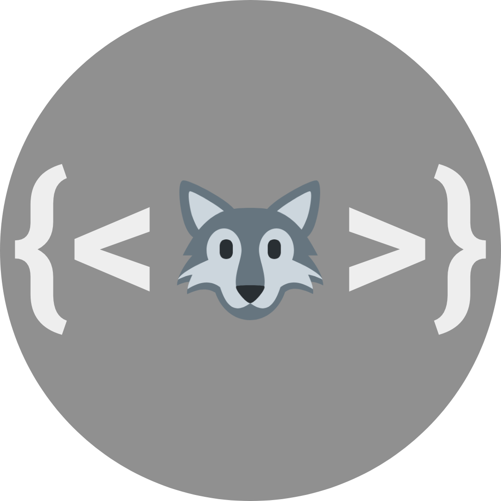

    
    <h1 align="center">Wolfrs</h1>
    <h3 align="center">A Front-End UI For Lemmy Built With Rust + Leptos</h3>

## A Lemmy UI for the modern era, built with modern tools

Wolfrs (pronounced wolf-ers) is a forward-looking Ui, built using the powerful, full-stack combination of the strongly-typed Rust and the signaling-based [Leptos](https://github.com/leptos-rs/leptos) web framework with Axum. Leptos uses signaling for its reactivity, much like SolidJS that it is based on, and has been demostrated to be faster and leaner than other Rust frameworks, such as Yew. It seems to represent a better path forward for Rust-based web frameworks, and using it for Wolfrs seems fitting for the nature of the project. Having a fully Rust-based UI for Lemmy feels like an important step forwards as well, given that Lemmy is also fully written in Rust. A truly full-stack, Rust-based application is quite a remarkable achievement, and I am proud to have Wolfrs be a part of that.

Wolfrs is designed to be flexible and easy to adapt, edit, change, re-spin, and implement for your Lemmy requirements. Unlike previous Lemmy UI's, Wolfrs has a focus on documentation, to help others in adapting Wolfrs to their needs. 

In that regard, Bootstrap was chosen for the CSS markup for the UI, due to it's ubiquitous nature, easily accessible documentation, and wide spread usage. Because of the way the project is being setup, it would be relatively easy to go back and change styling mechanics without needing to touch the underlying logic. So while there are newer frameworks out there, such as Tailwind, Bootstrap should be more than suitable for the UI, and can be easily replaced later on if desired.

Wolfrs uses a custom toml file, called `Instance.toml`, to set customization for the UI. This is to make it easy to adjust the UI to work with an instance, when deployed alongside it. This toml file can and will be expanded as more customization options present themselves. Suggestions are welcome for this as well.

## Goals and Plans

### Short-Term

- [X] Demonstrate basic functionality and proof-of-concepts
- [X] Create the basic structure for getting data from the Lemmy API
- [ ] Get basic API functionality working (ongoing)
- [ ] Get authentication working
- [ ] Get CRUD functionality working
- [ ] Get UI styling with Bootstrap fleshed out
- [ ] Implement sanitizing as insurance against any future potential XSS issues
- [ ] Ensure documentation is fully expanded to cover the workings of the program
- [ ] Achieve basic feature parity with the current, Inferno-based Lemmy front-end UI

### Long-Term

- [ ] Create new layouts to suite different users (infinite scrolling, card layout)
- [ ] Add front-end features to expand user customization
- [ ] TBD

## Installation

You can follow the [instructions](https://github.com/leptos-rs/leptos) from the Leptos github repo (or their [documentation book](https://leptos-rs.github.io/leptos/02_getting_started.html)) to understand the basics of getting up and running with Leptos. But here are some basic instructions for how to install and run this project. 

1. If you do not have it already, install Rust by going to [rustup.rs](https://rustup.rs/) and following the instructions for your system to install Rust.
(If you already have Rust installed on your system, make sure it is up to date by running `rustup update` in your terminal before proceeding.)

2. Leptos currently relies on the `nightly` version of Rust, to enable this run `rustup toolchain install nightly` from your terminal. Then run `rustup default nightly` to set your Rust version to this. (Note: The project includes a `rust-toolchain.toml` file to keep you from having to set your default Rust version to `nightly`, however, this proved buggy for me, so I can't recommend trying to work with it. It's easier just to set your default Rust version to `nightly` and then run `rustup default stable` once you are done with the project.)

3. Install the WASM compliation target by running `rustup target add wasm32-unknown-unknown` from your terminal ater you have set the Rust default to be `nightly`.

4. Leptos uses it's own build tool for working with Axum (and Actix too), hot reloading, and more. You will need this to fully work with the project as intended. To install it, run `cargo install cargo-leptos` from your terminal. **Note:** Axum uses OpenSSL as part of its build chain, which will require the installation of the OpenSSL developer libraries for your platform of choice. On Debian/Ubuntu, this can be installed by running `sudo apt install libssl-dev` (on Debian 12, I encountered an error that also required the installtion of `pkg-config` as well. If you still get a compilation error after installing the OpenSSL dev libraries, try installing `pkg-config` and see if that solves the issue). While on Fedora/RHEL/OpenSuse systems this can be done by installing the `libopenssl-devel` (or similarly named) package from your repositories. It may be diferent on other distros as well, you will need to search in your repositories for what OpenSSL dev libs to install.

5. Fork this project and place it in a directory of your choosing.

6. Navigate to this directory in your terminal and run `cargo leptos watch`. It will compile the project (Hopefully! please let me know if you encounter trouble with this) and then launched the UI on a localhost server and port listed in your terminal (default is 127.0.0.1:3000). 

7. Congratulations! You will have the project up and running, and will now be ready to start making contributions to it!

(Let me know if you encounter trouble along the way with these steps, and I'll try to help out as I can)

## License

&copy; 2023 Joshua Kimsey.

This project is licensed for contribution and usage under both the

- [BSD 3-Clause "New" or "Revised" License](https://spdx.org/licenses/BSD-3-Clause.html) ([`LICENSE-BSD-3-CLAUSE`](LICENSE-BSD-3-CLAUSE))
- [BSD-2-Clause Plus Patent License](https://spdx.org/licenses/BSD-2-Clause-Patent.html) ([`LICENSE-BSD-2-CLAUSE-PATENT`](LICENSE-BSD-2-CLAUSE-PATENT))

The [SPDX](https://spdx.dev) license identifier for this project is `BSD-3-Clause AND BSD-2-Clause-Patent`.

## Contributing

_Unless you explicitly state otherwise, any contribution intentionally submitted for inclusion in the work by you shall be dual licensed as above, without any additional terms or conditions._

This project is looking for people who are either familiar with Rust programming (especially if you have experience with Leptos!) or people familiar with Bootstrap styling. We welcome user and developer contributions to the project, to help expand and grow what it can offer. If you have any suggestions, please feel free to open an issue (will be moved to discussions eventually) an describe what you want added. 

If you are a devloper, please feel free to open a pull request for any additions you would like to add. All contributions that help grow the project are welcome! It is requested that you please document your code when making contributions for Rust or Leptos logic. Bootstrap/CSS styling contributions can simply document what they changed in the commit/pull request message.

As the project grows, I will look into opening other avenues of communications and organization as needed, such as on Telegram, Discord, etc.

**Important:** It needs to be noted that the Lemmy developers are also working on a Leptos-based UI for Lemmy. Their project was announced some time after I began working on Wolfrs, and is not associated with what I am working on here. Their project is licensed under a fully incompatible license (AGPLv3) with what I chose to release Wolfrs under. Any contributions to Wolfrs shall NOT copy from the Lemmy developers new UI project. It is fine to be _inspired_ by how they did something and implement it yourself, but you absolutely shall not copy their work outright to this project. Any work found to have been copied directly from them will be removed.

(There's a reason Wolfrs is being made, I'd prefer not having to perform cleanup on their code anyways...)

## Logo Attribution

The Wolf Emoji in the Logo is licensed from the [Twitter Twemoji Project](https://github.com/twitter/twemoji) under a CC-BY 4.0 License. 

Eventually I want a truly custom logo, but it will suffice for now. :)
